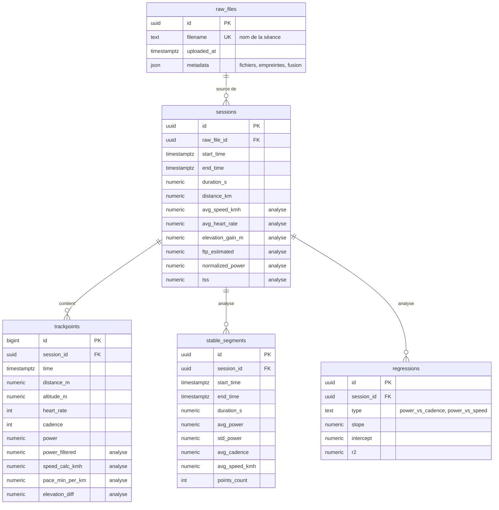

# Architecture

## Vue d'ensemble

```
                    ┌──────────────────────── poseidon (CLI) ────────────────────────┐
 fichiers .tcx ───> │ ingest/tcx.py ─> ingest/merge.py ─> ingest/store.py            │
                    │                                           │                    │
                    │                processing/analysis.py <───┤                    │
                    │                        │                  ▼                    │
                    │            processing/metrics.py      db/ (SQLAlchemy)         │
                    └────────────────────────┼──────────────────┬────────────────────┘
                                             │                  │
                                             │             PostgreSQL
                                             │                  │
                    ┌────────────────────────┴───── dashboard/ ─┴────────────────────┐
                    │ app.py (Streamlit) ─ data.py (requêtes + cache) ─ charts.py    │
                    │ pdf.py ─ i18n.py ─ formatting.py                               │
                    └────────────────────────────────────────────────────────────────┘
```

| Module                   | Responsabilité                                               |
| ------------------------ | ------------------------------------------------------------ |
| `config.py`              | variables d'environnement, `AnalysisParams`                  |
| `cli.py`                 | commande `poseidon` et ses sous-commandes                    |
| `db/models.py`           | tables SQLAlchemy                                            |
| `db/session.py`          | moteur créé à la demande, sessions transactionnelles, `init_db` |
| `db/repository.py`       | requêtes partagées (liste, suppression, remise à zéro)       |
| `ingest/tcx.py`          | lecture TCX sécurisée, dossiers de fichiers                  |
| `ingest/merge.py`        | fusion multi-fichiers et lissage aux jonctions               |
| `ingest/store.py`        | écriture d'une séance, détection des doublons                |
| `processing/metrics.py`  | calculs purs sur DataFrame, sans base ni interface           |
| `processing/analysis.py` | analyse d'une séance et écriture des résultats               |
| `dashboard/`             | interface Streamlit                                          |

## Principes

- **Calculs purs et partagés** : toute formule vit dans `metrics.py` et reçoit
  un DataFrame. Le job d'analyse et le dashboard appellent les mêmes
  fonctions, ce qui évite deux versions d'un même indicateur. Ces fonctions
  sont testées sans base.
- **Idempotence** : `init-db` ne crée que ce qui manque ; `analyze` supprime
  les résultats précédents avant d'écrire ; `ingest` refuse un doublon (ou
  l'ignore avec `--skip-existing`), ce qui permet de rejouer le workflow CI.
- **Transactions** : chaque commande travaille dans une transaction unique,
  annulée en cas d'erreur. Une analyse interrompue ne laisse pas de résultat
  partiel.
- **Volume maîtrisé** : le dashboard agrège les points côté base
  (`dashboard/data.py`) et met les résultats en cache 5 minutes.
- **Entrées non fiables** : les fichiers sont lus avec `defusedxml`, qui
  bloque les entités XML malveillantes ; l'import depuis le navigateur est
  désactivé par défaut.

## Modèle de données



Les colonnes marquées « analyse » sont vides tant que `poseidon analyze` n'a
pas tourné.

Index : `trackpoints (session_id, time)`, `sessions (start_time)`,
`stable_segments (session_id)`, `regressions (session_id)`.

Le schéma est créé par `poseidon init-db` (`create_all` de SQLAlchemy). Il
n'y a pas d'outil de migration : une évolution qui modifie une colonne
existante devra être accompagnée d'un script SQL.
